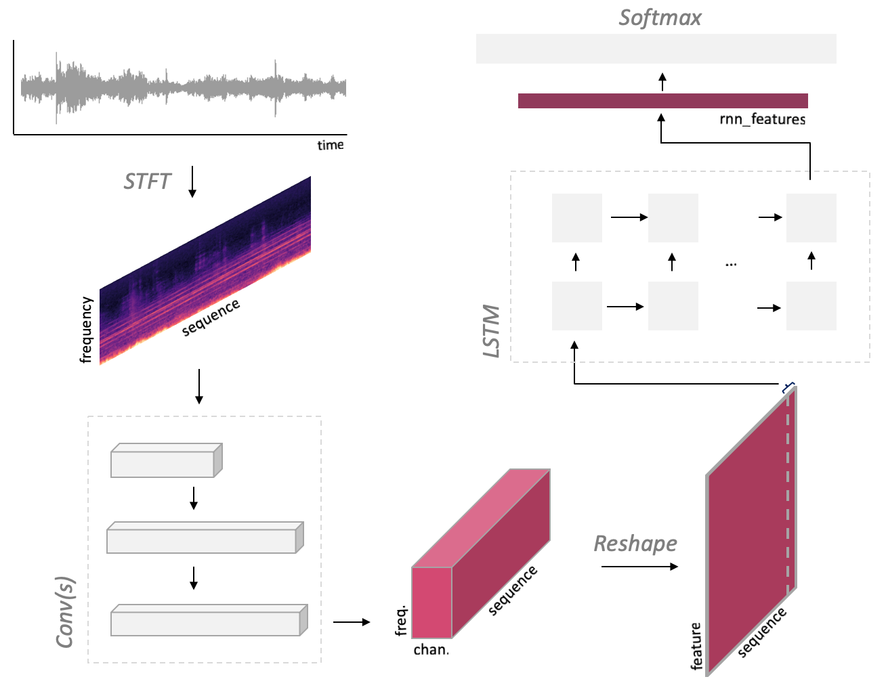

# PyTorch Audio Classification

Classification of audio with variable length using a CNN + LSTM architecture.

**DISCLAIMER**: This model architecture and codebase is based on the work of Kiran Sanjeevan and Tony Hung, see
the [original repository](https://github.com/ksanjeevan/crnn-audio-classification). In their work, the model was created
to classify sounds on the [UrbanSound8K](https://urbansounddataset.weebly.com/urbansound8k.html) dataset, a well-known
dataset containing labeled sound excerpts (<=4s) of urban sounds. The repository was released under the MIT license,
allowing us to freely modify and distribute the original code (
see [license](https://github.com/ksanjeevan/crnn-audio-classification/blob/master/LICENSE)).

#### Dependencies

* [soundfile](https://pypi.org/project/SoundFile/): audio loading
* [torchparse](https://github.com/ksanjeevan/torchparse): .cfg easy model definition
* [pytorch/audio](https://github.com/pytorch/audio): Audio transforms

#### Features

* Easily define CRNN in .cfg format
* Spectrogram computation on GPU
* Audio data augmentation: Cropping, White Noise, Time Stretching (using phase vocoder on GPU!)

### Model



Printing model defined with [torchparse](https://github.com/ksanjeevan/torchparse):

```
AudioCRNN(
  (spec): MelspectrogramStretch(num_bands=128, fft_len=2048, norm=spec_whiten, stretch_param=[0.4, 0.4])
  (net): ModuleDict(
    (convs): Sequential(
      (conv2d_0): Conv2d(1, 32, kernel_size=(3, 3), stride=(1, 1), padding=[0, 0])
      (batchnorm2d_0): BatchNorm2d(32, eps=1e-05, momentum=0.1, affine=True, track_running_stats=True)
      (elu_0): ELU(alpha=1.0)
      (maxpool2d_0): MaxPool2d(kernel_size=3, stride=3, padding=0, dilation=1, ceil_mode=False)
      (dropout_0): Dropout(p=0.1)
      (conv2d_1): Conv2d(32, 64, kernel_size=(3, 3), stride=(1, 1), padding=[0, 0])
      (batchnorm2d_1): BatchNorm2d(64, eps=1e-05, momentum=0.1, affine=True, track_running_stats=True)
      (elu_1): ELU(alpha=1.0)
      (maxpool2d_1): MaxPool2d(kernel_size=4, stride=4, padding=0, dilation=1, ceil_mode=False)
      (dropout_1): Dropout(p=0.1)
      (conv2d_2): Conv2d(64, 64, kernel_size=(3, 3), stride=(1, 1), padding=[0, 0])
      (batchnorm2d_2): BatchNorm2d(64, eps=1e-05, momentum=0.1, affine=True, track_running_stats=True)
      (elu_2): ELU(alpha=1.0)
      (maxpool2d_2): MaxPool2d(kernel_size=4, stride=4, padding=0, dilation=1, ceil_mode=False)
      (dropout_2): Dropout(p=0.1)
    )
    (recur): LSTM(128, 64, num_layers=2)
    (dense): Sequential(
      (dropout_3): Dropout(p=0.3)
      (batchnorm1d_0): BatchNorm1d(64, eps=1e-05, momentum=0.1, affine=True, track_running_stats=True)
      (linear_0): Linear(in_features=64, out_features=10, bias=True)
    )
  )
)
Trainable parameters: 139786
```

### Usage

#### Training

```bash
./run_lstm_raw_audio.py train -c config.json --cfg crnn.cfg
```

#### Evaluation

```bash
./run_lstm_raw_audio.py eval -r /path/to/saved/model.pth
```

#### Inference

Run inference on an audio file:

```bash
./run_lstm_raw_audio.py /path/to/audio/file.wav -r path/to/saved/model.pth 
```

##### Augmentation

Dataset transforms:

```bash
Compose(
    ProcessChannels(mode=avg)
    AdditiveNoise(prob=0.3, sig=0.001, dist_type=normal)
    RandomCropLength(prob=0.4, sig=0.25, dist_type=half)
    ToTensorAudio()
)
```

##### TensorboardX

The training data is displayed on `tensorboard` in real-time.
